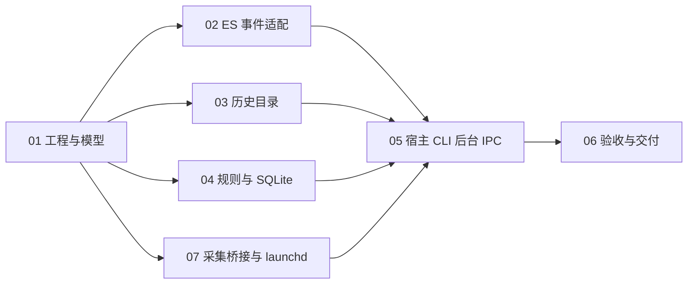

# 实现任务图与模块接入约定

Status: claimed
Type: task

用户 2026-10-03 显式调用 `implement-spec`，授权按 [spec](spec.md) 与 [技术基线](technical-design.md) 实现并交付 PR；此前整体确认等待由该指令解除。

- 所有代码注释用中文，测试数据匿名。不同实现者拥有独立 worktree／分支，不撤销他人改动。
- `src/model.rs` 是共同输入；ES 模块提供 `parse_line` 类入口与序号／解析健康追踪。历史模块返回目录候选和扫描报告；规则模块接收标准事件返回告警；SQLite 提供宿主使用的查询／写入 API。
- 模块 API 可在真实调用需要下收敛；将具体签名写在票据 Answer，模型或跨模块调整先交主 agent 协调。
- 每个实现者只修改自己的模块、测试和票据；不修改 Cargo.toml、Cargo.lock、src/lib.rs 或其他共享文件，依赖调整由主 agent 处理。
- 进程代际／源时间／序号字段不能补造。只有 PID 时必须暴露降级，不据此声称精确运行归属。
- 后台 raw JSON 不落盘；只有经过筛选的标准事件持久化。归档参数只瞬时提取工具与相关路径。
- 先建立真实采集能力证据，无法取得 root／FDA 时继续实现可验证部分，并保留真实采集未验证状态。
- 本仓库采用本地 Markdown tracker。PR Closing 引用对应本地 spec 与 01–06 票据，不创建未经请求的 GitHub issue。
- 07 从原 05 中拆出采集 IPC、launchd 和安装管理；与核心模块并行，05 负责普通用户宿主／CLI／通知。拆分只调整所有权与依赖，不改变规格范围。
