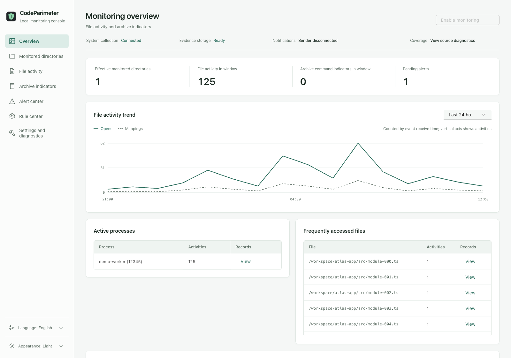
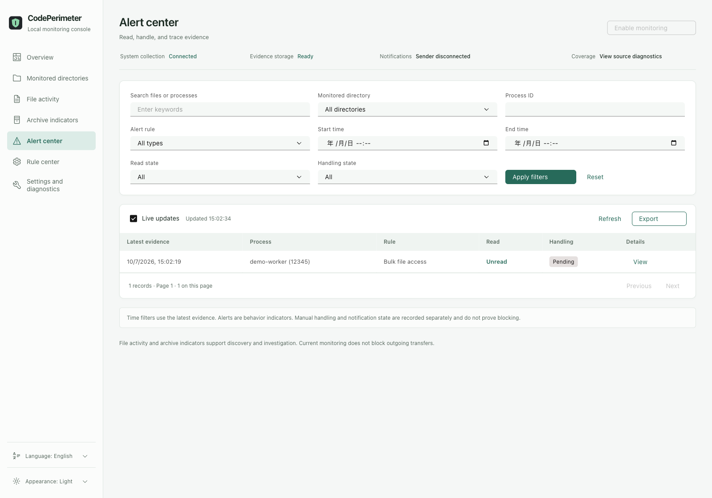
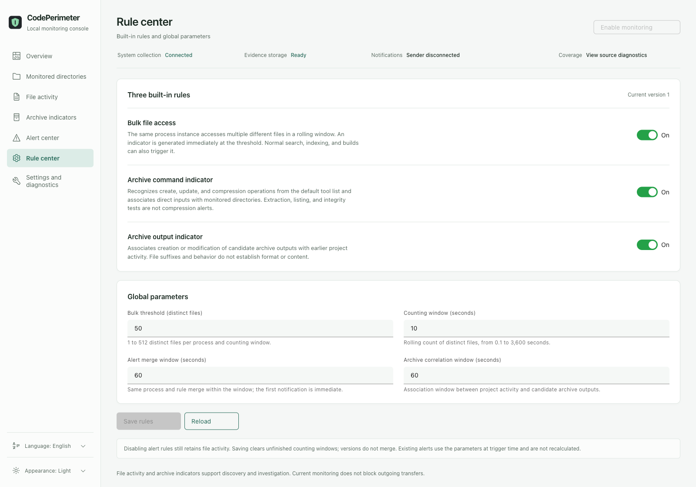

# CodePerimeter

English · [简体中文](README.zh-CN.md)


**Know what touches your code. Keep your monitoring data local.**

CodePerimeter is a local macOS monitor for project-file activity. Choose your project directories, see which processes access them, get alerts for concentrated access and archive indicators, and investigate the evidence in a bilingual web console.

[Quick start](#quick-start) · [Features](#features) · [Privacy](#privacy-by-design) · [Limits](#what-the-evidence-means) · [Documentation](#documentation)

> The current version observes and alerts. It does **not** block file access, compression, or network transmission.

## Why it matters

Your repository can contain private implementation details, credentials, configuration, and unreleased work. Giving an AI coding tool access to a project does not make every background process visible in its chat window. Indexing, helper processes, bulk scans, and archive operations deserve their own audit trail.

CodePerimeter gives you local evidence of who touched your projects and when activity became concentrated. It helps you investigate unexpected behavior without treating every search, build, or backup as a leak.

## Features

| Capability | What you can do |
| --- | --- |
| Project scope | Add multiple directories manually or with the native picker; preview and import directory candidates from Codex, Claude Code, and ZCode history |
| File activity | Review file opens, readable memory mappings, and related file/process events with process identity, filters, pagination, and detail views |
| Archive indicators | Automatically recognize 14 archive/compression command names and correlate candidate archive outputs with project activity |
| Understandable alerts | Receive native macOS notifications describing the behavior, program, project, and short filename; click to open the corresponding evidence |
| Alert handling | Mark read or handled, add notes, and inspect handling history; new evidence reopens the alert |
| Adjustable rules | Enable or disable three built-in rules and tune thresholds, observation windows, alert merging, and archive correlation |
| Local control | Install, start, pause, and resume services from the web console; inspect permissions, collection health, and coverage gaps |
| Records and export | Store evidence in SQLite, control retention, and export all pages of the current filters as JSON or CSV; anonymous sharing is the default |
| Language and appearance | Simplified Chinese and English, light/dark/system themes, and a persistent per-user language choice shared with subsequent notifications and CLI messages |

All processes are observed within the selected scope. You do not need to configure each AI tool or compression utility. History adapters discover **directory candidates**; their labels do not prove which tool caused a runtime event. Import is explicit, and new sessions do not automatically expand monitoring.

Default archive-command recognition:

```text
tar · bsdtar · gtar · zip · ditto · gzip · pigz
bzip2 · pbzip2 · xz · zstd · 7z · 7zz · rar
```

Common direct-path operations and supported explicit-input-to-stdout modes are covered. Decompression, listing, and integrity tests are excluded from compression-command alerts. Recognition does not install these tools; RAR is a separate proprietary tool.

## Product tour

Screenshots use the current web interface with **synthetic demo data and anonymous paths**. They contain no real project records and are not evidence of system collection or protection.

**Overview — activity trends, processes, files, and component health.**



**Alert center — filter records, review their status, and open the evidence before handling an alert.**



<details>
<summary>Rule settings</summary>



</details>

## Quick start

### 1. Build and open the console

The documented installation route is currently a source build. Use a Mac with `/usr/bin/eslogger`, Rust **1.88+**, Node.js **24**, and Xcode Command Line Tools, including the Swift compiler. Real collection has been tested on macOS **15.6.1**; other versions need their own compatibility checks.

```sh
git clone https://github.com/lolipop-1x1/CodePerimeter.git
cd CodePerimeter
npm --prefix web ci --ignore-scripts --registry=https://registry.npmjs.org
npm --prefix web run build
cargo build --release --locked
./target/release/codeperimeter ui
```

`web/dist/` is generated output and is not tracked by Git. `npm --prefix web ci` installs the dependency versions from `web/package-lock.json`; `npm --prefix web run build` generates the web assets in `web/dist/`. Build these assets before Rust; a missing web build stops Rust compilation with instructions.

After changing the web source, run `npm --prefix web run build` and `cargo build --release --locked` again. The resulting binary embeds the console and native notification helper. Node.js, a Swift compiler, and a separate frontend server are not required at runtime. Dependency installation uses `--ignore-scripts` to disable lifecycle scripts, including Carbon installation telemetry.

`ui` opens the default browser on a private loopback entry. No account or cloud service is required. Run the command again if an old entry expires; do not share URLs containing an entry credential.

### 2. Enable the background service and permissions

1. Open **Settings & diagnostics**, install the background service, then enable monitoring.
2. Enter the administrator password only in the **macOS authorization window**. The web page does not receive it.
3. In **System Settings → Privacy & Security → Full Disk Access**, enable `/usr/bin/eslogger` and the installed collector at `/Library/CodePerimeter/<UID>/codeperimeter`. Replace `<UID>` with the result of `id -u`; the console and service plan help identify the installed program.
4. Allow **CodePerimeter notifications** when macOS prompts. The notification helper does not need Full Disk Access.
5. Check actual collection and storage health in the console. An installed or loaded service alone does not prove that events are arriving.

You do not need your own Apple developer account for this source-based observation route. Locally built binaries use ad-hoc signing; updates can require restoring Full Disk Access and may leave older same-name permission entries. Signed distribution and notarization remain separate work.

### 3. Select projects

Open **Monitored directories**, add a path or use the native picker. Alternatively, preview Codex, Claude Code, or ZCode history and select candidates to import. You choose the scope; history discovery does not silently enable projects.

Disable a directory to exclude its entire subtree, even under an enabled parent. Removing a monitored directory changes configuration and does not delete project files or original history.

### 4. Review activity and alerts

Use **File activity** to inspect events, **Archive indicators** for command/output clues, and **Alert center** for evidence and notes. Clicking a system notification opens its associated alert, starting the console if needed. Clicking does not automatically mark the alert read or handled.

The default bulk-access rule triggers at **50 distinct files in a rolling 10-second window** for one process instance. Same-process, same-rule alerts merge for **60 seconds**: the first notification is immediate, and subsequent evidence updates the record. Change these settings in **Rule center**.

## Privacy by design

**CodePerimeter's monitoring data is processed and stored on your Mac. There is no cloud analysis, cloud translation, runtime telemetry, or account requirement.**

- The web console binds to loopback only; interface assets and language resources are bundled locally.
- Events, alerts, settings, and history-directory analysis stay local. History adapters extract directory metadata; session conversations are not saved as evidence.
- File contents, complete command lines, environment variables, and raw system-wide event JSON are not written to disk.
- Only collection and forwarding run as root. Analysis, the SQLite database, and notifications run as the ordinary user.
- Exports are user-controlled local downloads. Anonymous sharing replaces paths and process identities and removes free-text notes; full exports retain sensitive original fields.

Default user data directory:

```text
~/Library/Application Support/CodePerimeter/
```

`events.sqlite` stores evidence and configuration; `language.json` stores the language preference. Detail retention defaults to **30 days**; cumulative statistics are cleared separately. Paths, process identities, timestamps, and your notes can still be sensitive, so keep full exports private.

This local-data policy describes CodePerimeter. The AI tools and other processes you monitor retain their own network behavior and privacy policies.

## Pause or stop

**Pause monitoring** in the console stops system collection while history and configuration stay available. Closing a browser or launch terminal does not stop installed background monitoring.

To stop all three background service roles while preserving records and settings:

```sh
sudo ./target/release/codeperimeter service stop --user "$(id -un)"
```

To start them again:

```sh
sudo ./target/release/codeperimeter service start --user "$(id -un)"
./target/release/codeperimeter ui
```

Stopping services and closing the separate web console are independent actions. Queries need the ordinary-user management host. Uninstall also preserves records by default; see the [service guide](docs/service.en.md).

## CLI examples

Run these after the background service is enabled:

```sh
./target/release/codeperimeter status
./target/release/codeperimeter watch add ~/work/project-a ~/work/project-b
./target/release/codeperimeter events --limit 50
./target/release/codeperimeter alerts --limit 50
./target/release/codeperimeter history preview --output ~/Desktop/codeperimeter-candidates.json
./target/release/codeperimeter history import --preview ~/Desktop/codeperimeter-candidates.json --index 0
./target/release/codeperimeter --language en --help
```

Review the candidate preview before importing its index. It can contain real local paths; keep it outside the source checkout and do not commit it. CLI language overrides are temporary and do not change the saved preference. Full parameters and queries are in the [usage guide](docs/usage.en.md).

## What the evidence means

- **Open or readable mapping:** visible access evidence, not proof of every read, all file bytes, or file contents.
- **Bulk access:** concentrated activity, not proof of in-memory compression. Legitimate indexing, search, and builds can trigger it.
- **Archive command/output:** an operation or correlated output clue, not proof of archive contents, successful compression, or transmission.
- **Notification submitted:** a system submission receipt, not proof that a banner appeared.
- **Unknown or unhealthy collection:** a coverage gap, not zero activity or guaranteed safety.

List files, unclear stdin inputs, unknown arguments, cross-process associations, preloaded data, and pure in-memory operations have coverage limits. The current NOTIFY-based monitor does not intercept operations or inspect network request bodies.

Real validation has covered **14 command names / 92 scenarios**, and separate core/web runs have exercised real permissions, notifications, and notification navigation. These are bounded version-specific results, not continuous guarantees. Timeliness can degrade under sustained load, and system-wide collection can consume significant CPU even when the selected project scope is small. Pause or stop it if needed. Long-running performance, actual restart behavior, and bilingual background notification display remain separate validation items.

## Documentation

| Guide | Purpose |
| --- | --- |
| [CLI usage](docs/usage.en.md) | Queries, directory discovery, thresholds, validation, and stopping |
| [Background service](docs/service.en.md) | Privilege separation, installation, permissions, and data paths |
| [Archive validation](docs/validation/archive-command-coverage.md) | Versions, scenarios, latency, and coverage boundaries; Chinese |
| [Web validation](docs/validation/web-console-validation.md) | Browser and real-system results; Chinese |
| [Localization validation](.scratch/localization/validation.md) | Bilingual component/browser results and pending system checks; Chinese |
| [Product context](CONTEXT.md) | Goals, scope, and terminology; Chinese |
| [Feasibility](docs/research/feasibility.md) | File activity, archives, encryption, and control limits; Chinese |

For local development checks, run `npm --prefix web test`, `npm --prefix web run typecheck`, `python3 -B scripts/check-locales.py`, `cargo test --locked`, and `cargo clippy --locked --all-targets -- -D warnings`. They do not replace real system collection validation.

## License

[MIT](LICENSE) · Copyright (c) 2026 CodePerimeter contributors. Third-party components retain their own licenses.

Last reviewed: **2026-10-07**.
