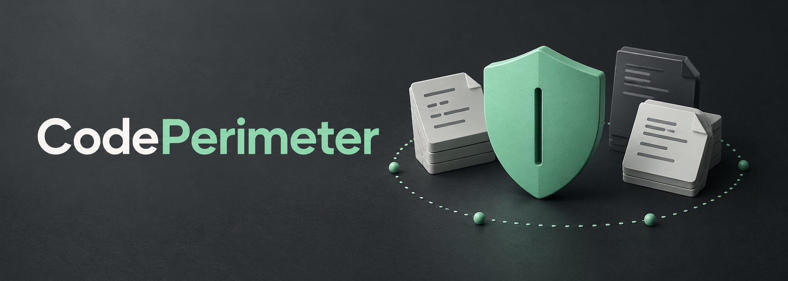
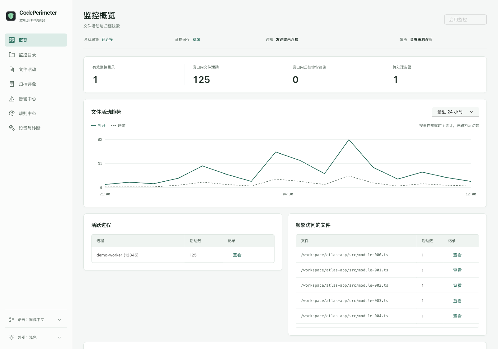
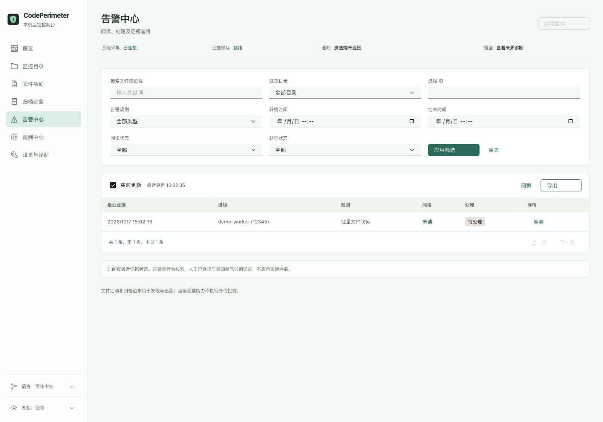
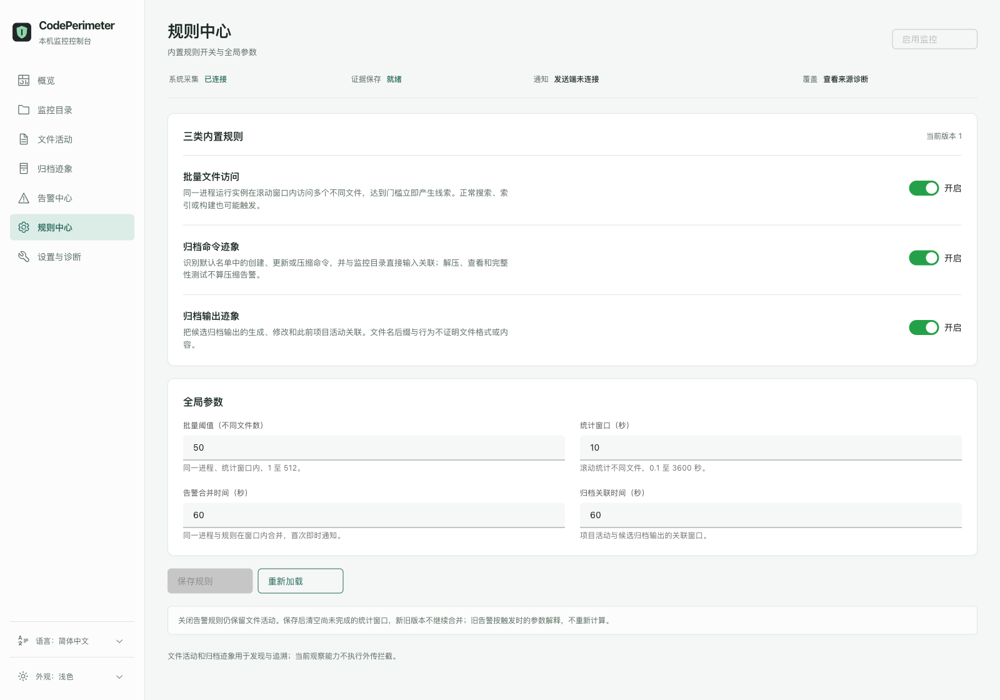

# CodePerimeter

[English](README.md) · 简体中文



**看清谁在访问你的代码，让监控数据留在本机。**

CodePerimeter 是面向 macOS 的本机项目文件活动监控工具。选择项目目录，查看访问它们的进程，接收批量访问与归档迹象告警，再通过中英文网页控制台追溯证据。

[快速开始](#快速开始) · [产品功能](#产品功能) · [隐私安全](#隐私安全) · [能力边界](#如何理解证据) · [文档](#文档)

> 当前版本提供观察与告警，**不能拦截**文件访问、压缩或网络传输。

## 为什么需要它

代码仓库里可能有未公开的实现、凭据、配置和尚未发布的工作。把项目访问权限交给 AI 编程工具，并不意味着聊天窗口会展示每个后台进程的活动。索引、辅助进程、批量扫描和归档操作，都值得有一份可回查的记录。

CodePerimeter 提供本机证据，帮助你看清哪些进程访问了项目、何时出现集中访问，以及异常行为的关联线索。正常搜索、构建和备份也会产生类似活动，判断风险需要结合证据与使用场景。

## 产品功能

| 功能 | 可以做什么 |
| --- | --- |
| 项目范围管理 | 手动添加多个目录、使用系统目录选择器，或预览并导入 Codex、Claude Code、ZCode 历史中的目录候选 |
| 文件活动记录 | 查看文件打开、可读内存映射及相关文件／进程事件，按进程、文件和时间筛选、分页与追溯详情 |
| 归档迹象发现 | 默认识别 14 个归档／压缩命令名称，关联候选归档输出与项目活动 |
| 易懂的系统提醒 | 原生 macOS 通知说明具体行为、程序、项目和短文件名；点击进入对应告警证据 |
| 告警处理 | 标记已读／已处理、添加备注、查看处理历史；收到新证据后重新打开告警 |
| 规则管理 | 独立开关三类内置规则，调整批量阈值、统计窗口、合并时间和归档关联时间 |
| 本机服务控制 | 从网页安装、启用、暂停与恢复服务，查看权限、采集健康及覆盖缺口 |
| 记录与导出 | SQLite 保存证据，可调保留时间；按当前筛选导出全部分页的 JSON／CSV，默认匿名分享 |
| 语言与外观 | 简体中文／英文、浅色／深色／跟随系统；同一用户语言偏好持久保存并影响后续通知与 CLI 提示 |

在选定范围内观察所有进程，无需逐个配置 AI 工具或压缩程序。历史适配提取的是**目录候选**，来源标签不证明运行时事件属于哪个工具。导入由你确认，新会话不会自动扩大监控范围。

默认识别以下归档／压缩命令：

```text
tar · bsdtar · gtar · zip · ditto · gzip · pigz
bzip2 · pbzip2 · xz · zstd · 7z · 7zz · rar
```

覆盖常见直接路径操作及工具支持的明确输入到标准输出模式；解压、查看与完整性测试不计为压缩命令告警。识别规则不会替你安装这些工具，RAR 属于独立的专有工具。

## 产品预览

以下截图使用当前网页界面与**合成演示数据、匿名路径**，没有真实项目记录，不作为系统采集或防护效果的验收证据。

**监控概览：活动趋势、进程、文件与组件状态。**



**告警中心：筛选记录、查看处理状态，进入详情追溯证据。**



<details>
<summary>规则设置</summary>



</details>

## 快速开始

### 1. 构建并打开控制台

目前文档提供的安装路线是源码构建。需要一台包含 `/usr/bin/eslogger` 的 Mac，以及 **Rust 1.88+、Node.js 24、Xcode Command Line Tools**（含 Swift 编译器）。真实采集已在 **macOS 15.6.1** 测试，其他系统版本需要单独验证兼容性。

```sh
git clone https://github.com/lolipop-1x1/CodePerimeter.git
cd CodePerimeter
npm --prefix web ci --ignore-scripts --registry=https://registry.npmjs.org
npm --prefix web run build
cargo build --release --locked
./target/release/codeperimeter ui
```

先构建网页资源，再构建 Rust。最终程序内嵌网页控制台和原生通知助手，运行时不需要 Node.js、Swift 编译器或独立前端服务。依赖安装禁用生命周期脚本，包括 Carbon 的安装遥测。

`ui` 会通过私有回环入口打开默认浏览器，无需账号或云服务。旧入口失效时重新运行命令；不要分享带入口凭证的地址。

### 2. 启用后台服务与权限

1. 打开**设置与诊断**，安装后台服务，再启用监控。
2. 管理员密码只在 **macOS 系统授权窗口**输入，网页不会接收密码。
3. 在**系统设置 → 隐私与安全性 → 完全磁盘访问权限**中启用 `/usr/bin/eslogger` 和已安装的采集器 `/Library/CodePerimeter/<UID>/codeperimeter`。用 `id -u` 的结果替换 `<UID>`，也可通过控制台与服务计划核对安装程序。
4. macOS 提示时允许 **CodePerimeter 通知**；通知助手不需要完全磁盘访问权限。
5. 回到控制台，核对采集与保存的实际健康状态。安装完成或任务已加载，不等于已经收到真实事件。

这条源码观察路线不要求你拥有 Apple 开发者账号。本机构建使用 ad-hoc 签名，更新后可能需要恢复完全磁盘访问权限，并留下同名旧权限项；正式签名分发与公证仍是独立工作。

### 3. 选择项目

在**监控目录**中填写路径或使用系统选择器，也可预览 Codex、Claude Code、ZCode 的历史目录后选择导入。监控范围由你决定，发现历史目录不会自动启用项目。

停用一个目录会排除整个子树，即使它位于已启用的父目录内。移除监控目录只修改配置，不删除项目文件或原始会话历史。

### 4. 查看活动与告警

在**文件活动**查看事件，在**归档迹象**查看命令／输出线索，在**告警中心**追溯证据与添加备注。点击系统通知会打开对应告警，必要时自动启动控制台；点击本身不会将告警标为已读或已处理。

默认批量规则为同一进程实例在**滚动 10 秒内访问 50 个不同文件**。同一进程、同一规则的告警在 **60 秒内合并**，首次立即通知，后续更新证据。可在**规则中心**调整参数。

## 隐私安全

**CodePerimeter 的监控数据均在你的 Mac 上处理与保存，没有云端分析、云端翻译、运行时遥测或账号要求。**

- 网页只监听本机回环地址，界面与语言资源随程序离线交付。
- 事件、告警、配置与历史目录分析留在本机；历史适配提取目录元信息，不把会话正文保存为证据。
- 不落盘保存文件正文、完整命令行、环境变量或原始全系统事件 JSON。
- 只有采集与转发使用 root 权限，分析、SQLite 与通知由普通用户运行。
- 导出是用户主动触发的本地下载。匿名分享替换路径和进程身份、移除自由文本备注；完整导出保留原始敏感字段。

默认用户数据目录：

```text
~/Library/Application Support/CodePerimeter/
```

`events.sqlite` 保存证据和配置，`language.json` 保存语言偏好。明细默认保留 **30 天**，累计统计独立清除。路径、进程身份、时间与备注仍可能包含敏感信息，完整导出应私下保管。

这项本地数据约定针对 CodePerimeter；被监控的 AI 工具和其他进程仍遵循各自的网络行为与隐私政策。

## 暂停与停止

网页中的**暂停监控**会停止系统采集，保留历史查询和配置管理。关闭浏览器或启动终端不会停止已安装的后台监控。

要停止全部三个后台角色，同时保留记录与配置：

```sh
sudo ./target/release/codeperimeter service stop --user "$(id -un)"
```

再次启动：

```sh
sudo ./target/release/codeperimeter service start --user "$(id -un)"
./target/release/codeperimeter ui
```

停止后台服务与关闭独立网页控制台是两个操作。查询需要普通用户管理宿主；卸载默认也保留记录，详见[后台服务说明](docs/service.md)。

## CLI 示例

以下命令在后台服务启用后使用：

```sh
./target/release/codeperimeter status
./target/release/codeperimeter watch add ~/work/project-a ~/work/project-b
./target/release/codeperimeter events --limit 50
./target/release/codeperimeter alerts --limit 50
./target/release/codeperimeter history preview --output ~/Desktop/codeperimeter-candidates.json
./target/release/codeperimeter history import --preview ~/Desktop/codeperimeter-candidates.json --index 0
./target/release/codeperimeter --language zh-CN --help
```

导入索引前先检查候选预览。它可能包含真实本机路径，应保存在源码目录外，不要提交到 Git。CLI 语言覆盖只影响本次调用，不修改保存的偏好。完整参数与查询方式见[使用说明](docs/usage.md)。

## 如何理解证据

- **文件打开／可读映射**：可见的访问证据，不证明每次读取、全部字节或文件内容。
- **批量访问**：集中活动，不证明内存压缩；正常索引、搜索和构建也可能触发。
- **归档命令／输出**：操作或关联输出线索，不证明归档内容、压缩成功或已外传。
- **通知提交成功**：系统接收回执，不证明横幅实际显示。
- **采集未知／异常**：覆盖缺口，不等于零活动或保证安全。

列表文件、不明确的标准输入、未知参数、跨进程关联、预加载数据与纯内存操作都有覆盖限制。当前基于 NOTIFY 事件的监控不拦截操作，也不检查网络请求正文。

真实验收覆盖过 **14 个命令名称／92 个场景**；独立核心与网页测试验证过真实权限、通知和通知跳转。这些是特定版本与场景的结果，不是持续保证。长时间高负载可能影响及时性，全系统采集也可能在项目范围较小时消耗明显 CPU，可按需要暂停或停止。长期性能、实际重启及后台双语通知到屏仍需单独验收。

## 文档

| 文档 | 内容 |
| --- | --- |
| [CLI 使用说明](docs/usage.md) | 查询、目录发现、阈值、验收与停止 |
| [后台服务说明](docs/service.md) | 权限分离、安装、授权与数据路径 |
| [归档验收](docs/validation/archive-command-coverage.md) | 工具版本、场景、延迟与覆盖边界 |
| [网页验收](docs/validation/web-console-validation.md) | 浏览器与真实系统结果 |
| [多语言验收](.scratch/localization/validation.md) | 中英文组件／浏览器结果与待验系统项 |
| [产品上下文](CONTEXT.md) | 目标、范围与术语 |
| [可行性调研](docs/research/feasibility.md) | 文件活动、归档、加密与控制边界 |

开发自检可运行 `npm --prefix web test`、`npm --prefix web run typecheck`、`python3 -B scripts/check-locales.py`、`cargo test --locked` 与 `cargo clippy --locked --all-targets -- -D warnings`，它们不能替代真实系统采集验收。

## 开源协议

[MIT](LICENSE) · Copyright (c) 2026 CodePerimeter contributors。第三方组件保留各自的许可证。

最后复核：**2026-10-07**。
