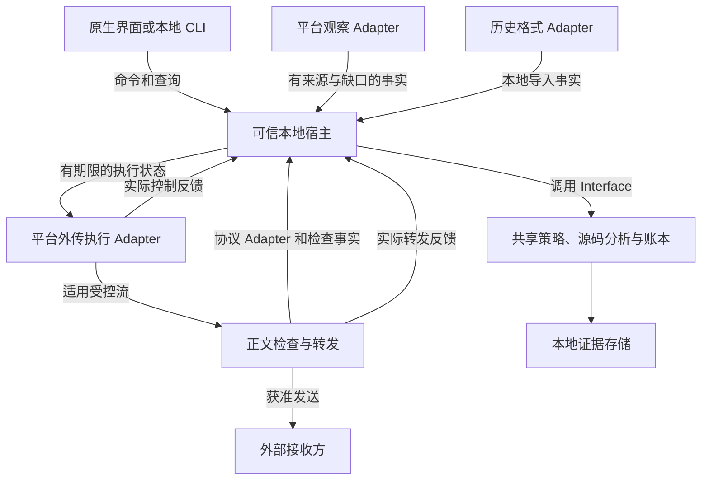

# 整体架构与技术候选

整理日期：2026-10-03。目标与术语以 [CONTEXT.md](../../CONTEXT.md) 为准。本文记录已确认的解耦要求及候选实现；不表示已完成系统接入、多平台实现或正式技术选型。

## 1. 架构目标与取舍

当前首先完成 Mac 上的项目活动发现与未经批准外传的控制。后续新增平台、客户端或模型协议时，应能复用策略、源码分析、证据和查询，分别适配变化部分。

| 层次 | 已确认要求 | 待验证的技术候选 |
| --- | --- | --- |
| 产品入口 | 保留桌面／IDE 与 CLI 原启动方式 | 按应用归属的系统控制与适用检查接入 |
| 共享核心 | 不依赖界面或平台系统框架 | Rust 实现规则、源码分析与证据账本 |
| Mac 原生能力 | 文件／进程观察与外传执行独立于界面 | Swift、Endpoint Security、Network Extension |
| 适用正文检查 | 实际发送前检查可见内容，保留能力缺口 | 本地 Rust HTTP／TLS 网关及客户端协议 Adapter |
| 本地界面 | 使用命令与查询，不持有独立批准状态 | SwiftUI，必要处 AppKit |
| 本地存储 | 由明确的唯一写入方维护证据与批准状态 | SQLite 与版本化数据迁移 |
| 后续平台 | 分别验证观察、控制、权限与故障 | Windows 和 Linux 原生 Adapter |

Rust 的可移植性为共享逻辑提供基础；Swift 便于调用 Mac 原生框架。组合也带来跨语言构建、内存所有权和诊断成本。具体库、最低系统版本、ABI 和进程数量由首个真实闭环决定。参考 [Rust 平台支持](https://doc.rust-lang.org/rustc/platform-support.html)。

先以真实调用者确定 Module（模块）的小 Interface（接口），把采集与执行复杂性封装在 Adapter（适配实现）中。当前不预制多个平台空实现、动态插件框架、远程控制服务或通用分布式系统。

## 2. 运行关系与代码依赖

以下为候选运行关系，不等同于已经部署的进程拓扑：

代码依赖方向与消息流分别描述：宿主装配实现；UI、平台 Adapter 和格式 Adapter 依赖共享 Interface；共享策略、源码分析和账本依赖平台无关模型及必要库。共享核心不导入 SwiftUI、Endpoint Security、Network Extension、Windows 驱动或 Linux 内核类型。

处理同一规则的所有入口调用同一个核心实现。UI 关闭不改变真实控制，历史导入不拥有网络权限，平台观察不自行成为第二套策略引擎。

## 3. Module 的职责与 Interface

| Module | Interface 承担的完整行为 | 内部实现及依赖 |
| --- | --- | --- |
| 项目与源码分析 | 根据项目快照和可检查内容返回来源范围、秘密分类、歧义和未知 | 增量索引、片段匹配、有界归档解析；不依赖系统过滤回调 |
| 策略与批准 | 根据事实、支持能力和已有批准返回允许／阻止／待确认及适用范围 | 接收方、内容、运行期间、有效期和共享额度；不自行读取系统事件或发送网络请求 |
| 活动关联 | 将可归属的进程、文件与网络事实组织成风险及解释 | 平台无关时间窗口与关联规则；接受缺失证据，不将相关性升级为内容同一性 |
| 证据账本与查询 | 记录观察、决定和实际反馈，按版本／接收方查询范围及统计 | 唯一写入路径、去重、迁移、保留／清除；UI 不直写数据库 |
| 可信本地宿主 | 核验调用方、装配上述 Module、协调运行身份与批准状态 | 平台权限、IPC 对端校验和生命周期；保持单一权威状态 |
| 平台观察 Adapter | 返回文件／进程／流等原始语义、身份、来源、序号和缺口 | ES、ETW、fanotify／eBPF 等不同实现，不制造相同精度的读取事件 |
| 平台外传执行 Adapter | 把有效控制状态应用到覆盖的流，并返回实际结果 | NE、WFP、nftables／eBPF 等；分别验证已有连接和执行层故障 |
| 正文检查与转发 | 在有界资源下检查实际正文，提交获准请求并报告发送进度 | 协议解析、TLS、流式转发和资源隔离；原始正文仅按需短暂存在 |
| 客户端协议 Adapter | 从支持的请求格式提取内容和账号线索，报告解析覆盖 | 格式与版本变化不修改系统控制逻辑；客户端自报身份不是可信归属 |
| 历史格式 Adapter | 将指定版本历史转为带来源的消息、工具与内容事实 | 不把文本日志直接计为已发送，不获得运行时批准权限 |
| 界面与本地查询入口 | 展示覆盖、风险、执行结果和范围，并提交用户命令 | 不持有第二份规则、批准或转发权，渲染不阻塞控制路径 |

源码分析和活动关联可以先作为核心内部实现；没有第二个真实使用场景时不强行拆成独立包。Module 的可替换性通过 Interface 和行为场景实现，文件数量不是解耦质量指标。

## 4. 跨模块事实与可信归属

稳定的是语义和不变量，具体字段编码待原型收敛：

| 契约 | 必须保留的信息 |
| --- | --- |
| 项目快照 | 内容版本、统计分母、文件版本和排除规则 |
| 应用／进程身份 | 可验证来源、运行期间、父子或后台归属、未知状态；PID 可复用 |
| 观察事实 | 来源、时间／序号、事件语义、成功或尝试、能力与丢失情况 |
| 检查事实 | 实际接收方、内容版本、解析覆盖、可定位范围和未知原因 |
| 策略决定 | 对应请求／流、原因、范围、策略版本及有效期 |
| 批准 | 应用运行身份、项目、接收方和内容绑定；临时例外另带统一额度 |
| 执行反馈 | 已应用、失败、部分提交或未知，附关联决定与流标识 |
| 账本证据 | 观察、会话可见、出口提交、接收端实收等等级及其来源 |

请求头中的应用名、PID 或账号不能替代平台来源身份。协议中的账号只有可核实后才能用于已知账号批准。共享网关向外发送时保留原客户端关联，避免把所有活动归到网关自身。

事件可能乱序、丢失或重复。按来源序号和运行身份进行有依据的去重；没有稳定标识时说明局限。发送证据缺失不能结算为零外发，重复导入不能重复增加覆盖或频次。

## 5. 平台与格式扩展

系统差异和客户端差异位于两个独立的 Seam（可替换位置）：

- 新增客户端：增加身份识别和协议／历史格式 Adapter，复用项目、规则和账本；逐个验证正常任务、后台任务、认证和出口。
- 新增模型格式：增加内容解析及兼容场景，复用系统归属和执行。未知字段、超限和不支持格式报告检查不足。
- 新增操作系统：实现观察、控制、安装和权限 Adapter，保留相同的核心策略语义及验收场景。
- 新增展示入口：通过同一本地查询／命令 Interface 使用结果，保持唯一批准与存储写入路径。
- 新增规则：使用已有事实与决定语义；如果需要新的系统事实，先声明能力要求并验证平台支持。

每个 Adapter 报告观察、归属、新连接控制、已有连接处理、正文检查和故障控制等能力，状态至少区分已验证、不支持、未验证和降级。保留粒度、来源、版本及原因。

策略先检查所需能力，再判断内容。未支持或未知不自动降为允许；无法覆盖的路径也不能被描述为已经阻止。产品状态以已验证的覆盖组合形成，避免一个跨平台“保护开启”布尔值掩盖差异。

## 6. 各平台候选机制

本表承接此前调研，只列候选与约束；API 存在不表示保护闭环成立。

| 平台 | 观察候选 | 控制候选 | 单独验证的部分 |
| --- | --- | --- | --- |
| macOS | Endpoint Security 文件／进程事件；早期采样可用已签名观察工具 | Network Extension，适用正文检查入口 | entitlement、签名、公证、用户授权、归属、旧连接、检查与扩展故障 |
| Windows | ETW 文件／进程事件；需要文件操作授权时评估 Minifilter | WFP；专门流处理是否需要内核 callout 单独评估 | 用户态与驱动的必要边界、签名、系统安全配置、BFE／驱动故障及旧流 |
| Linux | fanotify／eBPF；可参考 Tetragon 的行为与执行机制 | nftables／eBPF 与适用检查入口 | 内核版本、特权、命名空间、挂载与缓存／映射 I/O 语义、进程关联 |

这些机制均不自动提供任意 HTTPS 明文或应用层解密。平台事件不能按 API 名称机械映射；文件通知不一定逐次对应实际读取。Windows／Linux 迁移还须分别处理安装、升级、卸载、系统策略、VPN／代理共存和运行权限。

参考：[Apple ES](https://developer.apple.com/documentation/endpointsecurity)、[Apple NE](https://developer.apple.com/documentation/networkextension)、[Windows ETW](https://learn.microsoft.com/en-us/windows/win32/etw/fileio)、[Minifilter](https://learn.microsoft.com/en-us/windows-hardware/drivers/ifs/about-file-system-filter-drivers)、[WFP](https://learn.microsoft.com/en-us/windows/win32/fwp/windows-filtering-platform-start-page)、[fanotify](https://man7.org/linux/man-pages/man7/fanotify.7.html)、[Tetragon](https://tetragon.io/docs/concepts/enforcement/)、[nftables](https://wiki.nftables.org/wiki-nftables/index.php/What_is_nftables%3F)。

## 7. 运行权限与安全职责

Mac 候选为可信宿主维护权威状态，原生执行层持有最小、可到期的控制状态，正文解析在权限较小且可限制资源的路径中运行。是否必须分进程，依据系统扩展要求、权限和故障隔离证明后确定。

IPC 核验对端身份、命令权限与版本。历史文件、请求正文和客户端自报字段属于不可信输入；UI 和历史导入不能伪造系统身份、批准或发送证据。本地证书与签名材料由专门受限的宿主管理，不存入分析账本。

调用放行时再次核验绑定和期限，避免批准后内容替换。重启、身份变化或策略版本失效应使运行期批准失效。时限采用单调时间；墙上时间用于展示。

不可检查例外的总上行预算由唯一权威路径管理；并发请求、重试和多个执行实例共享同一预算。额度预留、提交与不确定结果要保守处理，崩溃不能按未发送重新发满额度。

用户弹窗不在系统授权回调中无限等待；先给范围明确的控制结果，再让用户批准并重试。回调不执行全仓扫描或复杂归档解析。TLS 可见正文仍可能包含应用层密文，见 [可行性调研](../research/feasibility.md)。

## 8. 跨语言与数据

如果采用 Rust／Swift，优先验证窄 C ABI，明确句柄、缓冲区所有权、释放、线程约束、错误和版本。Rust panic 不跨语言栈展开；跨进程契约与 ABI 分开演进。候选参考：[Rust FFI](https://doc.rust-lang.org/nomicon/ffi.html)。

账本的写入方负责 schema 迁移、事务、去重和保留规则；多进程选择单写入通道或明确的事务协调方式，不给每个进程独立账本。查询输出聚合范围和证据引用，UI 自行渲染。

完整请求正文仅在检查与转发必要期间短暂缓冲。必要源码快照／索引本身也可能含敏感内容，应限定文件权限、用途、保留和清除；不能因为未存请求就声称卫士没有敏感数据。

大项目采用增量索引、批量事件入库、有界队列和有界正文／归档解析。队列过载、存储故障或观察丢失显式报告降级。CPU、内存、额外延迟、误拦、丢事件与审批频率均用实际样本测量，当前不冻结性能数值。

## 9. 故障语义

| 故障 | 要求与验证边界 |
| --- | --- |
| UI 关闭 | 观察与执行继续，批准状态不依赖 UI 进程 |
| 网关或检查路径失效 | 原生执行层默认继续阻止已纳管外传，本地操作可用；该行为须取得接收证据 |
| 宿主失联或决定过期 | 原生执行层默认阻止已纳管外传，报告失联和能力变化；不能沿用过期放行 |
| 原生执行层崩溃／未加载 | 单独实测系统行为；不默认宣称仍然阻止，产品显示覆盖缺失 |
| 事件队列溢出或来源缺失 | 呈现采集缺口；依赖该事实的规则不得报告完整覆盖 |
| 数据库失败或反馈缺失 | 决定与发送证据保持区别，不虚构保存成功或零外发 |
| 请求部分发送后失败 | 记录已知提交／实收部分与未知剩余，按止损或失败呈现 |

故障阻止是产品要求，不能仅靠核心代码返回阻止来证明。平台无法满足时回到范围讨论；对应实验见 [核心验收方案](../validation/core-validation.md)。

## 10. 演进顺序与决策门槛

1. **Mac 观察切片**：合成项目验证事件、归属、关联与正常任务对照；确定最小事实 Interface。
2. **Mac 控制闭环**：真实系统执行、检查入口、正常请求和故障一起验证；保留原启动方式。
3. **固定最小契约**：从实际调用者提炼稳定的规则、执行反馈和查询 Interface，记录已证明的技术决策。
4. **地图与历史**：复用同一源码模型和证据语义，完成独立显示与格式验收。
5. **Windows／Linux 迁移**：选择目标系统与支持对象，实现平台 Adapter，复用公共行为场景并重新验证实际控制。

当前未确定网关库、ABI 编码、所有进程拆分、默认阈值、最低平台版本或完整分发路线。后续技术决策写入 `docs/adr/`，明确证据、代价与被替代选项。

共享核心可构建只是迁移的一部分。每个平台必须重新取得“观察正确、禁止载荷受控、正常任务完成、故障行为成立”的证据，方可声明该平台支持。
